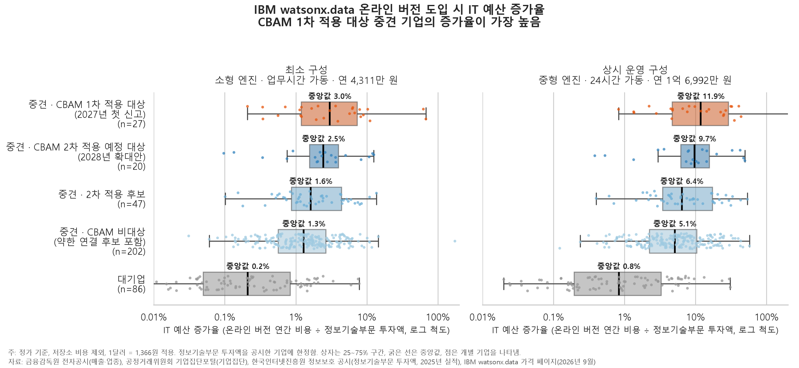
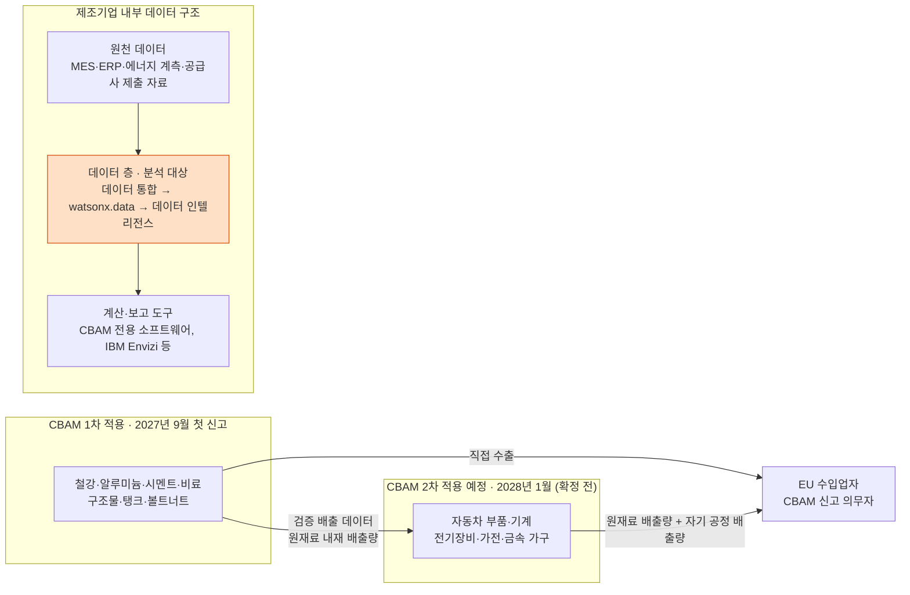

# 중견 제조기업의 데이터 층 진입 비용 분석: EU CBAM 적용 단계 기준

`cbam-mfg-data-layer-entry`

## 요약

**분석 질문**
- EU 탄소국경조정제도(CBAM) 시행으로 제조기업의 데이터 관리가 선택 과제에서 의무 과제로 전환되는 시점에, 국내 중견 제조기업 중 대응 시점이 가장 이른 기업군은 어디인가
- 해당 기업군이 IBM watsonx.data 등 데이터 층을 도입할 경우 실제 IT 예산 대비 부담 수준은 어느 정도인가

**분석 결과**
- 상장 중견 제조기업 645곳 중 2028년까지 CBAM 대응이 필요한 기업: **최소 94곳(15%) ~ 최대 189곳(29%)**
- CBAM 1차 적용 대상 중견 기업의 정보기술부문 투자액 중앙값: **14.3억 원** (CBAM 비대상 중견 기업 33.3억 원의 절반 이하)
- watsonx.data 온라인 버전 도입 시 IT 예산 증가율(중앙값)
  - 대기업: 0.2% (최소 구성) ~ 0.8% (상시 운영 구성)
  - CBAM 1차 적용 대상 중견 기업: **3.0% ~ 11.9%**, 상위 25% 기업은 상시 운영 구성 시 **28.9% 이상**
- CBAM 1차 적용 대상 중견 기업 58곳 중 2025년 사업보고서에 CBAM을 언급한 기업 5곳, 데이터·시스템 대응을 기재한 기업 1곳

**시사점**
- 대응 시점이 이른 기업일수록 IT 예산 규모가 작으므로, 진입 경로는 소규모·사용량 기반 구성이 필요함
- 설치형·BYOC는 가격 비공개로 판정 대상에서 제외함. CBAM 1차 적용 대상 중견 기업 중앙값 기준 IT 예산 1% = 연 1,433만 원 단위로 평가 가능함



## 배경: CBAM 적용 단계와 데이터 연결 구조

- **1차 적용 (현행 CBAM)**
  - 대상: 철강·알루미늄·시멘트·비료 원재료, 철강 구조물·탱크·볼트너트 등 일부 1차 가공품
  - 2026년 수입분 첫 신고 기한: 2027-09-30
- **2차 적용 예정 (확대안)**
  - EU 집행위원회 제안 COM(2025) 989 (2025-12-17): 자동차 부품·기계·전기장비·가전 등 약 180개 하류 제품
  - 2028-01-01 적용 예정, EU 최종 협상 진행 중
- **두 단계를 연결하는 규칙** (EU 시행규칙 2025/2547)
  - 복합 제품 배출량 = 자기 공정 배출량 + 원재료 내재 배출량 (구매처와 무관)
  - 외부 원재료의 실제 배출량은 공인 검증 보고서가 있는 경우에만 인정되며, 없는 경우 해당 원재료에 기본값 적용
  - 철강·알루미늄 등 기본값 할증: 2026년 10% → 2027년 20% → 2028년 이후 30% (시행규칙 2025/2621)
- **연결 구조:** 1차 적용 대상 기업의 검증 배출 데이터가 2차 적용 예정 대상 기업 신고의 입력값이 됨
- 법적 신고 의무자는 EU 수입업자이며, 국내 제조기업은 데이터 제공자에 해당함



## 분석 결과

### 1. 대상 기업 선별

| 단계 | 기준 | 기업 수 |
|---|---|---|
| 전자공시 등록 회사 | | 119,447 |
| 상장사 | 종목코드 보유 | 3,994 |
| 제조업 상장사 | 유가증권·코스닥, 업종코드 10~34 | 1,610 |
| 중견 기업 | 공정위 기업집단 소속 여부, 중소기업기본법 기준 판정 | 657 |
| 분석 대상 중견 기업 | 지주회사형 제외 (이중 집계 방지) | **645** |

- 규모 판정: 상호출자제한기업집단(47개) 소속 → 대기업, 그 외 공시대상기업집단(55개) 소속 → 중견, 미소속 기업은 업종별 3년 평균 매출·자산 5,000억 원 기준으로 중소·중견 구분

### 2. CBAM 적용 단계 구분 (중견 기업 645곳)

| 구분 | 기업 수 | 근거 |
|---|---|---|
| 1차 적용 대상 (2027) | 58 | 현행 CBAM 대상 업종 |
| 2차 적용 예정 대상 (업종 해당) | 21 | 확대안 대표 제품 업종 |
| 2차 적용 예정 대상 (제품명 확인) | 15 | 자동차 부품 후보 중 사업보고서 문맥 검토로 확인 |
| **최소 합계** | **94 (15%)** | |
| 2차 적용 후보 | 95 | 업종코드 단위가 넓어 품목 구분 불가 |
| **최대 합계** | **189 (29%)** | |
| 2차 적용 후보 (약한 연결, 최대값 제외) | 24 | 의료기기·측정기기 등 대상 품목이 일부에 한정된 업종 |
| 비대상 | 432 | |

### 3. 사업보고서 기준 CBAM 인식 수준

- 중견 기업 645곳 사업보고서 원문 전수 검색
- CBAM 언급 기업 8곳 (1.2%), 그중 1차 적용 대상 5곳
- 데이터·시스템 대응 기재: 전과정평가(LCA) 시스템 구축 1곳
- 사업보고서 미기재가 대응 미비를 의미하지는 않음

### 4. 진입 비용: IT 예산 증가율

- IT 예산: 한국인터넷진흥원 정보보호 공시의 정보기술부문 투자액 (추정값 미사용)
- 공시값 확보: 중견 기업 296곳, 대기업 86곳

| 그룹 | 정보기술부문 투자액 중앙값 | 최소 구성 (연 4,311만 원) | 상시 운영 구성 (연 1억 6,992만 원) | 상시 운영 구성, 상위 25% |
|---|---|---|---|---|
| 대기업 | 204.5억 | 0.2% | 0.8% | 3.3% |
| 중견 전체 | 28.6억 | 1.5% | 5.9% | 13.0% |
| 중견 · 1차 적용 대상 | 14.3억 | **3.0%** | **11.9%** | **28.9%** |
| 중견 · 2차 적용 예정 대상 | 17.6억 | 2.5% | 9.7% | 15.7% |
| 중견 · 비대상 | 33.3억 | 1.3% | 5.1% | 10.4% |

- IT 예산 증가율 = watsonx.data 온라인 버전 연간 비용 ÷ 정보기술부문 투자액
- CBAM 대응은 필수 지출 성격으로, "IT 예산의 증가 폭"으로 해석함

### 5. 설치형·기존 기반 추가·BYOC 기준선 (가격 비공개)

| 그룹 | IT 예산 1% 금액 | 신규 프로젝트 예산 전액 (15~21%) | 기존 기반 추가 시 VPC당 연 상한 |
|---|---|---|---|
| 중견 · 1차 적용 대상 | 1,433만 원 | 2.15억~3.01억 원 | 1,075만~1,505만 원 |
| 중견 · 2차 적용 예정 대상 | 1,762만 원 | 2.64억~3.70억 원 | 1,321만~1,850만 원 |
| 중견 전체 | 2,857만 원 | 4.29억~6.00억 원 | 2,143만~3,000만 원 |

- 신규 프로젝트 비중 15%(Deloitte 2020), 21%(Deloitte 2023)는 참고용 상한
- VPC 상한은 워커 1대분(20 VPC) 기준

## 진입 경로

| 경로 | 내용 | 국내 보관 | 가격 공개 |
|---|---|---|---|
| A. 온라인 버전(SaaS) | IBM 운영 | 불가 (공개 자료상 서울 리전 없음) | 공개 |
| B. 신규 설치 | Fusion HCI 등 신규 구축 | 가능 | 비공개 |
| C. 기존 기반 추가 | 기존 OpenShift 위 설치 | 가능 | 비공개 |
| D. BYOC | 고객 클라우드 계정에 설치 | 가능 (국내 리전 사용 시) | 비공개 |

## 분석 방법

| 단계 | 내용 | 코드 |
|---|---|---|
| 1 | 전자공시 상장 제조기업 매출·자산·업종 수집 | `01_collect_dart.py`, `01b`~`01d` |
| 2 | 규모 판정, 배출권 명단 대조, CBAM 적용 단계 업종 분류 | `02_classify.py`, `02b`, `02c_flag_wave2.py` |
| 3 | 사업보고서 원문 검색 (CBAM 언급, 자동차 부품 제품명), 문맥 검토 반영 | `03_search_reports.py`, `03b`, `03c_apply_review.py` |
| 4 | 정보기술부문 투자액 연결, 진입 비용 계산 | `04a_it_spend.py`, `04_cost_model.py` |
| 5 | 그래프 작성 | `05_figures.py` |

**데이터 출처**

| 데이터 | 출처 |
|---|---|
| 상장사 재무·업종·사업보고서 | 금융감독원 전자공시(OpenDART) API |
| 기업집단·소속회사 (2026-05) | 공정거래위원회 기업집단포털 |
| 배출권거래제 할당대상업체 (2026-01-01 기준) | 기후에너지환경부 |
| 기업별 정보기술부문 투자액 (2025년 실적) | 한국인터넷진흥원 정보보호 공시 종합 포털 |
| 중소기업 업종별 매출 기준 | 중소기업기본법 시행령 별표 1 (2025-10-01 개정) |
| CBAM 대상 품목·규칙 | EU 규정 2023/956, 시행규칙 2025/2547·2025/2621, 확대안 COM(2025) 989 |
| watsonx.data 가격·라이선스 | IBM watsonx.data 가격 페이지, IBM Redpaper REDP-5720 |
| IT 예산 배분 추이 | Deloitte 글로벌 CIO 조사, 글로벌 기술 리더십 조사 |

## 한계

- 상장사만 대상으로 함. 정보기술부문 투자액 공시가 없는 중견 기업 349곳(주로 매출 3,000억 원 미만)은 비용 부담 측정 제외
- CBAM 대상 품목 EU 수출 기업 다수가 중소·중견 기업이라는 분석이 있어, 측정 제외 구간의 부담이 더 클 가능성 있음
- 기업별 EU 수출 여부 미확인. 업종·제품 기준으로만 적용 단계 구분
- 2차 적용 예정 품목은 EU 최종 협상 중으로 변경 가능. 기본값·할증은 2027년 말까지 재검토 예정
- 업종코드가 3자리로 등록된 기업은 세부 품목 구분 불가 (후보로 분류)
- IBM 정가 기준, 저장소 비용 제외. 기본 지원비의 엔진 정지 시 과금 여부 미확인
- 정보기술부문 투자액은 감가상각 기준이므로 실제 IT 지출보다 작게 집계될 수 있음 (증가율이 높게 산출될 가능성)
- 1차 적용 대상 공시값 확보 27곳, 2차 적용 예정 대상 20곳으로 표본 규모가 작음
- 데이터 층이 1·2차 적용 단계를 연결하는 경로가 된다는 판단은 규정 구조에서 도출한 가설임

## 재현 방법

```powershell
python -m venv .venv
.\.venv\Scripts\Activate.ps1
python -m pip install -r requirements.txt
```

1. `.env`에 `DART_API_KEY=발급받은키` 작성
2. `data/external/`에 공정위 기업집단별 개요·소속회사 개요, 배출권거래제 할당대상업체 현황, 정보보호 공시 이행 기업 리스트(2025·2026) 저장
3. 아래 순서로 실행

```powershell
python src\01_collect_dart.py
python src\01d_patch_revenue.py
python src\02_classify.py
python src\02c_flag_wave2.py
python src\03_search_reports.py
python src\03c_apply_review.py
python src\04a_it_spend.py
python src\04_cost_model.py
python src\05_figures.py
```

- `01b`, `01c`, `02b`, `03b`는 점검용 코드

## 폴더 구조

```
├─ src/                 분석 코드
├─ data/
│  ├─ raw/              전자공시 원자료·사업보고서 캐시 (GitHub 제외)
│  ├─ interim/          중간 결과
│  ├─ processed/        최종 결과 (cost_by_company.csv, cost_summary.csv)
│  └─ external/         외부 공개 자료
├─ figures/             그래프
└─ docs/progress/       단계별 진행 기록
```

## 진행 기록

- [0단계: 방향 설정·설계](docs/progress/step0_planning.md)
- [1단계: 데이터 수집](docs/progress/step1_data_collection.md)
- [2단계: 규모 판정 및 CBAM 적용 단계 구분](docs/progress/step2_classification.md)
- [3단계: 진입 비용 계산](docs/progress/step3_cost_model.md)